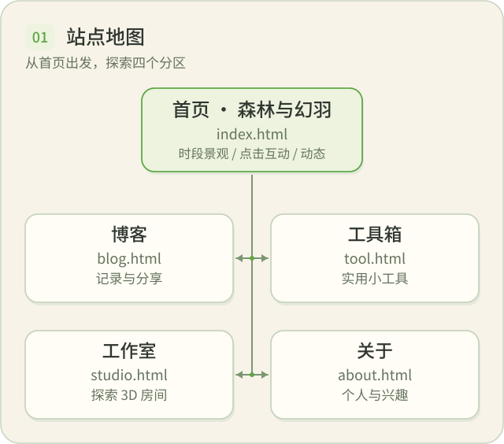
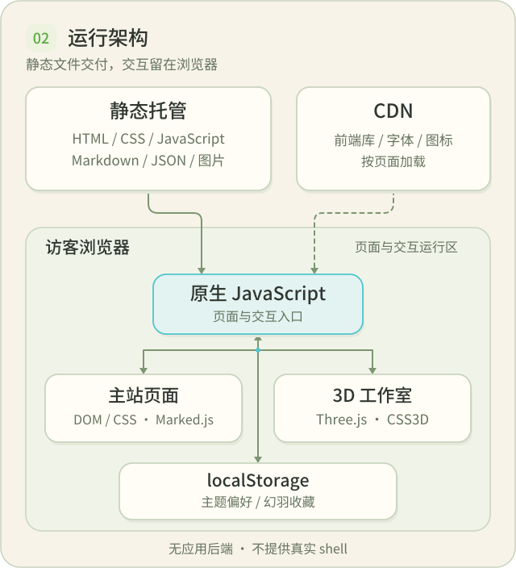
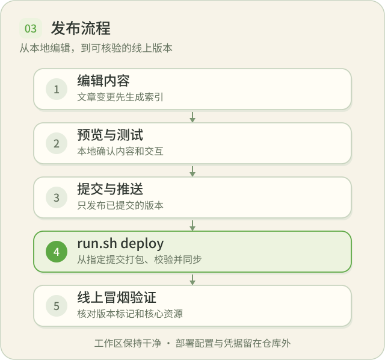

<p align="center">
  
</p>

<h1 align="center">Huanfly · Personal Web</h1>

<p align="center">在一片手绘森林里，记录、分享、创造。</p>

<p align="center">
  <a href="https://huanfly.com">在线体验</a> ·
  <a href="#功能">站点地图</a> ·
  <a href="#技术栈">运行架构</a> ·
  <a href="#使用">快速开始</a>
</p>

开源的纯静态个人网站，包含博客、在线工具箱、个人展示和 Three.js 工作室。

> **原生 HTML / CSS / JavaScript** · **无前端构建** · **无包管理器** · **无应用后端**

## 功能



| 入口 | 可以做什么 |
| --- | --- |
| 🌿 **首页** | 时段森林、活动时间线、小羽点击互动、临时气泡与星屿手记 |
| ✍️ **博客** | Markdown 文章、标签筛选、搜索、主题封面与可选评论 |
| 🧰 **工具箱** | 图片转 ICO、键位练习、链接转换器、下载中心与技术可视化 |
| 🛠️ **工作室** | 环视 3D 房间、设备模拟、昼夜切换、开窗导览，以及屏内终端和相册 |
| 📷 **关于** | 个人介绍、摄影、科技制作与阅读内容 |

博客正文、ICO 转换和兴趣详情均在各自页面内切换。写作见[博客发布流程](docs/design/blog-auto-publish.md)；终端与 Robot 的能力边界见[工作室约束](docs/design/workbench.md#终端与-robot-的能力边界)。

## 设计风格

**暖纸绘本 → 时段森林 → 夜森林。** 罗小黑风格的手绘笔触，搭配森林绿与灵气青；首页景观随时段变化，工作室延续温暖、克制的科技感，共享页脚由睡着的小羽陪伴。交互尊重减少动态偏好。

视觉规则见[设计系统](docs/design/design-system.md)，房间构图与设备约束见[工作室要素约束](docs/design/workbench.md)。

## 技术栈

**浏览器负责渲染与交互，托管端只提供静态文件。** 前端库、字体和图标按页面需要经 CDN 加载。



> **能力边界：**终端始终是浏览器内模拟，不连接真实 shell；Robot 仅为「研究中」静态占位。giscus 评论是可选外部服务，未配置时不加载，不属于自建后端。

## 项目结构

| 路径 | 内容 |
| --- | --- |
| `index.html`、`blog.html`、`tool.html`、`about.html` | 主站页面 |
| `studio.html` | Three.js 工作室入口 |
| `css/`、`js/` | 共享样式、页面逻辑与场景模块 |
| `posts/`、`activity.json` | 博客文章、文章索引与站点动态 |
| `tools/` | 独立工具页 |
| `picture/`、`interests/` | 站点图片、角色资产与兴趣素材 |
| `tests/` | 契约测试与浏览器回归，不随站点部署 |
| `docs/` | 设计文档、待办与 README 图示 |
| `run.sh` | 本地预览、索引生成和部署入口 |

具体模块位置与修改入口见 [AGENTS.md](AGENTS.md#项目索引)；添加兴趣素材前阅读相应子目录的 `README.md`。

## 使用

### 本地预览与验证

```bash
./run.sh test          # 本地预览，默认端口 8080
./run.sh test 3000     # 指定预览端口
./run.sh gen           # 文章变更后生成索引，审查并随文章提交
node --test tests/*.test.js
```

按改动范围运行相应浏览器回归，命令及环境要求见 [开发与验证](AGENTS.md#开发与验证)。浏览器视口模拟不能替代[工作室真机验收](docs/todo/studio-real-device-acceptance.md)。

### 发布到静态托管



提交并推送后，在干净工作区中执行：

```bash
DEPLOY_TARGET='user@example.com:/srv/www/blog/' \
PUBLIC_BASE_URL='https://blog.example.com' \
./run.sh deploy HEAD
```

配置接口、产物边界、验证与回退统一见[部署文档](docs/design/deployment-architecture.md)。生产配置与凭据留在仓库之外；使用托管平台原生发布流程时，按该文档的外部平台边界处理。
